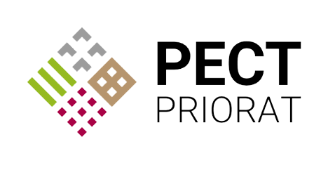

  
# What is PECT-Priorat?
És un projecte finançat amb fons de desenvolupament Europeu i recolzat pel consell comarcal del Priorat i altres institucions, empreses i ens de renom en aquesta localitat, basa la seva tasca en potenciar el desenvolupament econòmic, fer una gestió sostenible del paisatge i preservar els valors agricoles i culturals de la comarca. 
En aquesta pàgina web s'exposen els objectius i les operacions realitzades pel projecte PECT Priorat.
## Motivation
Aquesta pàgina web s'ha creat com a treball final a partir de l'assignatura de *Producció, disseny cartografic i eines web* impartida al grau de *Geografia, anàlisi territorial i sostenibilitat* per la URV.  
Per aquest treball final s'ha decidit reelaborar parcialment la [Pàgina web original del projecte](http://pectpriorat.cat/) amb motiu principal de dotar-la d'una component geogràfica que actualment no disposa, tot afegint un mapa web dins l'apartat de banc de terres que permetrà localitzar informació de forma ràpida, mostrar l'iniciativa de cara al públic de forma més dinàmica i millorar la qualitat de la web amb aquest nou recurs. També cal fer esment en les mancançes o falta d'informació que contenen les fitxes de cada parcel·la cedida, sense referencia cadastral ni coordenades de localització, un fet que també es preten modificar. 

**Els objectius a assolir són:**
1. Remodelar la pàgina web amb elements i estructura propia tot mantenint continguts dicatats pel propi projecte
2. Elaborar una pàgina a la web sobre l'apartat del banc de terres on es mostrin en forma de fitxes imatges georeferenciades, referencia cadastral assignada i una breu descripció de cada parcel·la cedida
3. Crear un mapa web on es visualitzi cada aparcel·la cedida i una breu descripció amb imatge
## Data
Les dades utilitzades per a elaborar els continguts argumentals son en la gran majoria extretes de la pàgina web original amb la finalitat de no distorsionar el que el propi pojecte ha conclos en que el representa.  
Per a la cartografia, s'han extret les parcel·les del cadastre del IGN, agafant unicament aquelles que mostra l'apartat del banc de terres a la pàgina original. El mètode per a elaborar el mapa i extreure les geometries s'exposa en l'apartat *Qgis2web* d'aquest readme.md. En total s'han aconseguit X parcel·les amb les següents característques:  

|ID|X|Y|Mun|RefCad|Ha|Tipus|regadiu|
| ------------- |:-------------:|:-------------:|:-------------:|:-------------:|:-------------:|:-------------:|-------------:|
|P01|	320959.2|	4557651.7|	Pradell de la Teixeta|	43117A01200016|	0,88|Avellaner|No|
|P02|	321717.0|	4558226.8|	Pradell de la Teixeta|	1784627CF2518D| 0,08|Oliverar|No|
|P03|	321697.0|	4558214.3|	Pradell de la Teixeta|	1784628CF2518D| 0,06|Oliverar|No|
|P04|	321624.0|	4558181.5|	Pradell de la Teixeta|	43117A01400116| 0,42|Oliverar|No|
|P05|	321286.0|	4556999.3|	Pradell de la Teixeta|	43117A01300012| 0,91|Avellaner|No|
|P06|	321268.0|	4556875.3|	Pradell de la Teixeta|	43117A01300058| 3,04|Forestal|No|
|P07|	322845.0|	4559656.5|	Pradell de la Teixeta|	43117A00500222| 0,34|Avellaner|No|
|P08|	322875.0|	4559612.5|  Pradell de la Teixeta|	43117A00500009| 1,06|Avellaner|No|
|P09|	320623.5|	4559880.0|	Pradell de la Teixeta|	43117A00100003| 1,52|Matollar|No|

## Web structure
L'estructura de la web es resumeix en una simple dinàmica entre *5 pestanyes* on totes es comuniquen a través d'una barra d'accés ràpid a la capçalera. Entre els apartats es troba:
- **Índex**: és una mostra molt resumida de les principals idees del projecte. També és la principal pestanya que dona accés a les següents.
- **El projecte**: apartat que mostra els fonaments teórics i accions per als quals s'ha donat el projecte
- **Terrenys**: llisat de fitxes amb informació sobre els diferents terrenys cedits per propietaris particulars
- **Visor de terres**: mapa on es mostren els diversos terrenys cedits amb informació resumida
- **Contacte**: espai per a establir contacte amb l'equip del projecte de forma senzilla 
 

Visualitza l'**estructura i continguts complerts** de cada pàgina en el següent document: 

   
## Qgis2web
La component geogràfica de la web traduida en un mapa incrustat a l'apartat de vissor de terres, s'ha assolit a través de l'ús de técniques de teledetecció, informació cadastral, referencies de la web original i el software lliure Qgis amb el pluguin Qgis2web. 

Inicialment es van extreure les parcel·les cadastrals de les finques cedides de Pradell de la Teixeta a través de fer comparacions de les imatges aportades per la web original amb les dimencions i geometries de les parceles cadastrals presentades pel plugin de Qgis del Cadastro INSPIRE. 

  

Un cop obtinguts els polígons de les parcel·les cedides al projecte, es va modificar la taula d'atributs per a assolir l'informació imprescindible que seria representada, a més d'afegir capes secundaries com topografía o una ortofoto. 

  
  

A continuació s'activa el plugguin de Qgis2web per acabar baixant una carpeta amb un arxiu html que serà pujat al Github per a representar el mapa i les característiques que se li ha ordenat que mostrés. 

  
## Improvements, difficulties, modifications

